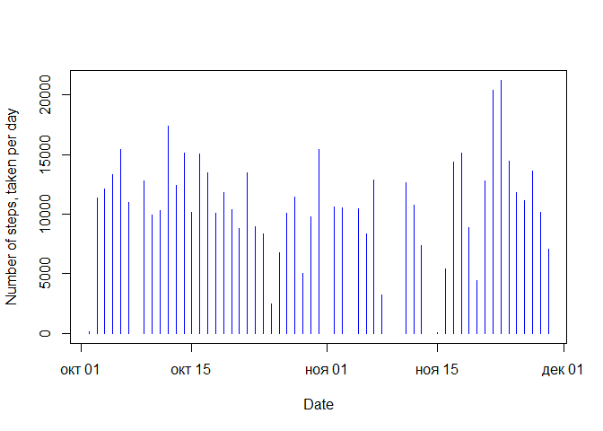
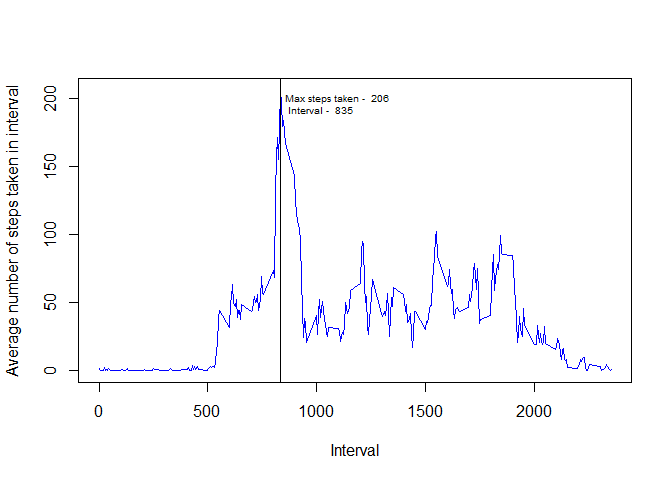
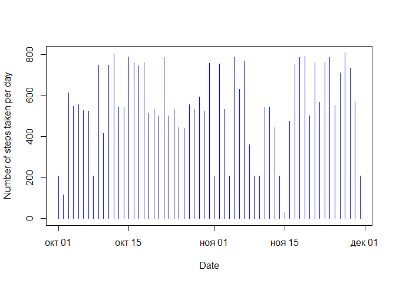
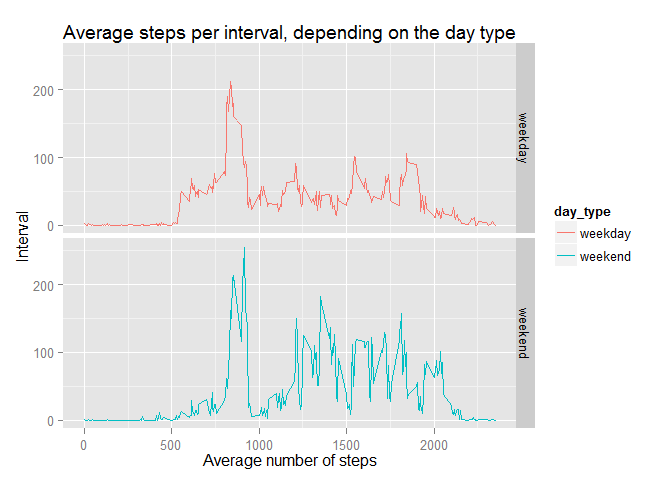

# Reproducible Research: Peer Assessment 1

It is now possible to collect a large amount of data about personal movement using activity monitoring devices such as a Fitbit, Nike Fuelband, or Jawbone Up. These type of devices are part of the “quantified self” movement – a group of enthusiasts who take measurements about themselves regularly to improve their health, to find patterns in their behavior, or because they are tech geeks.

\
Having got these data, we decided to analyze them and look at what are the pattern of people's daily activities.

## Loading and preprocessing the data
\
Before starting any analysis we need to load the data and make some preprocessing steps. Below is the peace of code, where we load the data in R and make some data types transformation (for dates)
\


```r
#unzipping the archive with data and reading the file
library(ggplot2)
unzip("./activity.zip")
data <- read.csv("activity.csv", sep=',', header=TRUE)

# transforming the type of Date column from factor into "Date" type
data$date <-as.Date(data$date)
```

## What is mean total number of steps taken per day?

Not, let's go to some analysis. Let find, what are the average number of steps people do each day.
\
Here is the R code, which does this analysis, and the histogram, showing the result:
\

```r
# coping RAW data to the new frame - total_per_day
total_per_day <- data.frame(steps = data$steps, date = data$date)

# eliminating NA's values in "steps" column
total_per_day <- total_per_day[!is.na(total_per_day$steps),]

# aggregating "steps" values by "date" column, applying sum function to calculate totals
total_per_day <- aggregate(total_per_day$steps, by = list(total_per_day$date), sum)
```

```r
# plotting the final fram with total numbers of steps for each day
with(total_per_day, plot(total_per_day$Group.1, total_per_day$x, xlab = "Date", ylab = "Number of steps, taken per day", type = "h", col = "blue"))
```

 
\

Below, you can also see the detailed table with mean and median of total steps, taken per day


```r
summary(total_per_day$x)
```

```
##    Min. 1st Qu.  Median    Mean 3rd Qu.    Max. 
##      41    8841   10760   10770   13290   21190
```

## What is the average daily activity pattern?
\
For mapping out the daily activity patterns, we will group the data by time interval, calculate average number of steps for each interval across all days and plot them.

The code below represents all there necessary steps:
\

```r
# coping RAW data to the new frame
average_per_interval <- data.frame(steps = data$steps, interval = data$interval)

# eliminatin NA's values in "steps" column
average_per_interval <- average_per_interval[!is.na(average_per_interval$steps),]

# aggregating "steps" values by "interval" column, applying mean function to calculate the means
average_per_interval <- aggregate(average_per_interval$steps, by = list(average_per_interval$interval), mean)
names(average_per_interval) <-c("interval","steps")

# plotting the data
with(average_per_interval, plot(average_per_interval$interval, average_per_interval$steps, xlab = "Interval", ylab = "Average number of steps taken in interval", type = "l", col = "blue"))

# finding the interval with highest steps
vl <- average_per_interval[order(-average_per_interval[,2]),]

# drawing the vertical line through the interval with highest steps
with(average_per_interval, abline(v=vl[1,1]))

# adding the corresponding label to the line, drawn above
txt <- paste("Max steps taken - ", round(vl[1,2]), "\n", "Interval - ", vl[1,1])
text(x=vl[1,1]+20, y=vl[1,2]-10, labels = txt, adj = 0, cex = 0.6)
```

 
\
\
The mapping between intervals and day times
\
0           - 00:00 am,
\
500         - 05:00 am,
\
1000        - 10:00 am,
\
1500        - 03:00 pm,
\
2000        - 08:00 pm,
\
2355        - 11:55 pm.
\
\
As you can see, at around 8:35, there is a peak of daily activity, where the number of steps is the highest. 
\
The next periods of intense activity happen around afternoon, which might be possibly explained with usual lunch break at 12.00 am, and as well as at 3.00 pm and around 6 pm, which may be explained with traditional coffee-breaks and going home parts of the working day.


## Imputing missing values
\
Original dataset has a lot of missing values in "steps" column, which may introduce bias in our analysis. In order to avoid this, we replace all NA's in "steps" date with the the corresponding average number of steps for a given time interval, we calculated above. And we look again how the picture looks now for the total steps per day.
\
Below you can find the R code, performing necessary operations
\

```r
# Creating a new data set, by copying from the set with raw data.
# We will fill each NA value in steps column with average value of steps for the corresponding time interval across all days
data_imp <- data

# identifying NA's
na <- !is.na(data_imp$steps)

# will run the loop for the whole set, may be it could be done more faster and 
# efficient without a loop
for(i in 1:length(data_imp$steps)){ 
        # checking, if the steps value is NA in the current row
        if(is.na(data_imp[i,"steps"])){
                # if the steps value is NA, then we put the average value for 
                # this time interval
                data_imp[i,"steps"] <- average_per_interval[average_per_interval$interval == data_imp[i,"interval"],2]
        }
}
```

Having done calculations, we can look at the final date on the histogram below:

\

```r
with(data_imp, plot(data_imp$date, data_imp$steps, xlab = "Date", ylab = "Number of steps taken per day", type = "h", col = "blue"))
```

 
\
Below, you can also see the detailed table with mean and median of total values
\

```r
summary(data_imp$steps)
```

```
##    Min. 1st Qu.  Median    Mean 3rd Qu.    Max. 
##    0.00    0.00    0.00   37.38   27.00  806.00
```
\
You may have mentioned that having done these transformation to unbias our raw data, we got more realistic statistics - the median value now is equal to zero, because average steps at night and early morning are equal to zero, as well as at late evening. And the mean value, which now more correctly counts night hours, have fallen dramatically.


## Are there differences in activity patterns between weekdays and weekends?
\
Now, let's find the activity patters and their differences between weekdays and weekends? Let find the average steps per interval on weekdays and on weekends.
\
The code below represents the necesary transformations and calculations, followed by the data plot with the result.
\

```r
# copy prepocessed data from the previous question
wd <- data_imp

# because of the problem with launching the code on the russian-language machine, the weekdays numbers and order in the vector were different from if the code would be launched on the english-language system. So I decided to take an indirect method of labeling measurements as weekdays or weekends. I used POSIXlt class and its attribute "wday" to get the number of the week, and then using it, I made the two-level factor variable and then performed required analysis.

# create the vector wda. FOr each i, wda[i] equals to the number of the way in a week for the corresponding wd$date.

wda <- as.POSIXlt(wd$date)$wday

# put the vector wda to the wd frame
wd <- cbind(wd, wda)

# identify satudays and sundays, put them into a separate vector
wdn <- (wd$wda == 6 | wd$wda == 7)

# put the "weekday" value in our new vector, for all weekdays
wdn[!wdn] <- "weekday"

# put the "weekend" value in our new vector, for all weekends
wdn[ wdn == "TRUE"] <- "weekend"

# put he result to the original vector as a new column
wd <- cbind(wd, wdn)

# aggregate "steps" values by "interval" and "wdn" column, which indicates whether the measurement is to the weekday or weekend, with applying mean function to calculate the averages across weekdays/weekends and intervals
av_per_int_wd <- aggregate(wd$steps, by = list(wd$interval, wd$wdn), mean)
names(av_per_int_wd) <-c("interval","day_type", "steps")

# plotting the data, using qplot and facets attribute to show separately data for weekdays and weekends
qplot(av_per_int_wd$interval,av_per_int_wd$steps, data=av_per_int_wd, facets = day_type~., geom = c("line"), main = "Average steps per interval, depending on the day type", xlab = "Average number of steps", ylab = "Interval", color = day_type)
```

 
\
As you can see, the pattern is quite simillar with the most activities done in the morning, afternoon, 3 pm, but at the weekdays, the average steps except early morning is lower in general, then on weekends. The possible explanation may be that people on weekend have more free time, which they might use on some activities, resulting in more steps taken.
\
